# Explication Fork

Ceci va vous expliquer comment mettre en place un projet avec l’outil **Fork**, et comment bien l’utiliser afin d’éviter au maximum les conflits et surtout de casser votre projet.

## Mise en place du Projet avec Fork

- **Création du clone du projet**
- **Création de notre branche de travail**
- **Envoi des modifications sur le serveur**
- **Récuperation de la branche commune**
- **Récupération du travail**
- **Merge des modifications sur la branche de travail commune**
- **Remise à niveau de ma branche de travail**

### Création du clone du projet

Ouvrir **Fork** et aller sur **l’Url de votre projet GitHub**. Sur votre logiciel **Fork**, ouvrir l’onglet **File** situé en **haut à droite**.

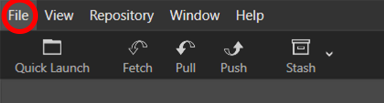

L’onglet qui va nous intéresser dans la section **File** est **Clone**  .

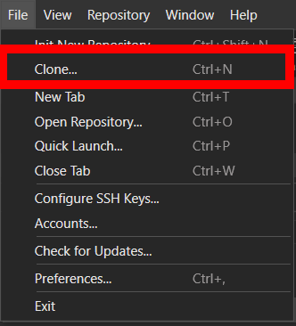

Après avoir cliqué dessus, cette fenêtre va s’ouvrir  .

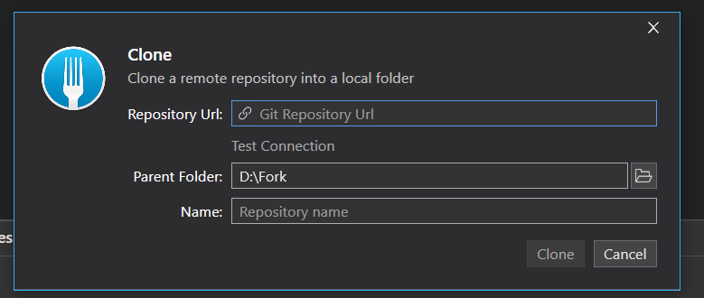

Il faudra récupérer votre **adresse HTTPS** que vous trouverez sur votre **projet GitHub**, tout vos projets sont positionnés sur le **coté droit** de votre navigateur, il ne reste plus qu’à sélectionner le projet qui vous intéresse. 

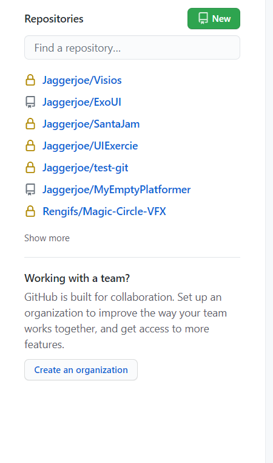

Vous trouverez **l’adresse HTTPS**, en cliquant sur l’encadré vert **Code**.

  

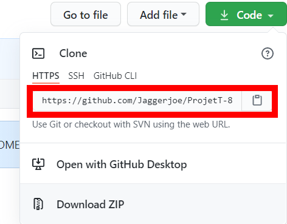

Il restera alors à copier votre **adresse HTTPS**, et la **coller** dans **Fork**, dans votre **fenêtre Clone**, à l’emplacement **Repository URL**. Indiquez ensuite un chemin à votre projet ainsi que le nom du dossier dans lequel il va être rangé.  

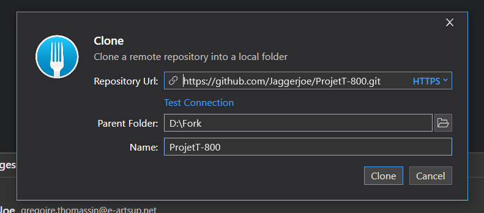

Votre projet est alors créé, vous pouvez voir apparaître votre **branche master**. 
 
 ### Création de notre branche de travail  

Lorsque vous travaillez en groupe, **il ne faut pas travailler sur la branche master**, vous devez donc **créer** votre propre **branche de travail**. Sur **Fork**, il vous suffit juste de cliquer sur le bouton **New Branch**.

  

Vous aurez donc une fenêtre qui s’ouvrira, dans laquelle il faudra indiquer le **nom** que portera votre **branche**.

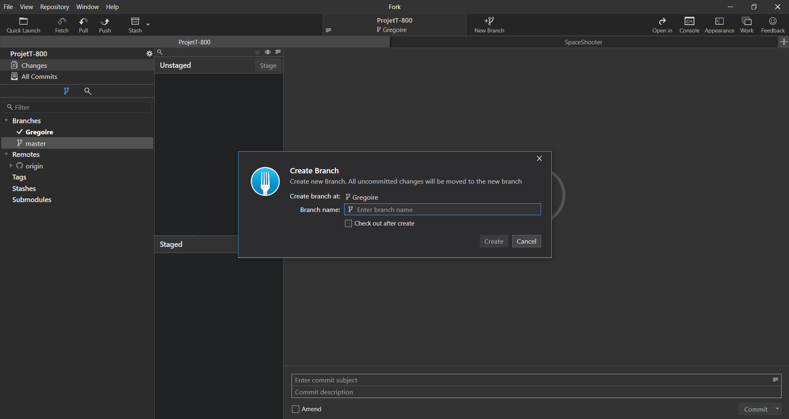  

Votre nouvelle **branche** apparaîtra alors sur la **gauche** de votre **logiciel.**
Lorsque vous travaillez, vérifiez toujours de bien être sur **votre branche**, si vous n'êtes pas dessus, faite un **double clic** sur **votre branche** et si vous êtes déjà dessus, un **icone de validation** sera a coté de **votre branche**  

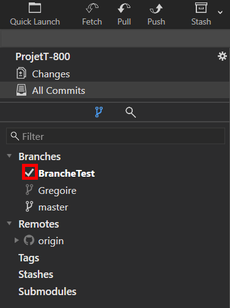  

Si vous voulez mettre **votre branche** sur **le serveur**, il vous suffira juste de **vérifier** de bien être sur celle-ci, et d'appuyer sur le bouton **Push**, situé en haut.

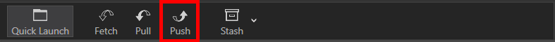 
 
Puis, vous n'aurez qu'a **confirmer**.

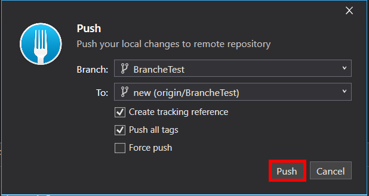

### Envoi des modifications sur le serveur

Lorsque vous travaillez sur votre projet, n'oubliez pas de sauvegarder via **CTRL + S**, mais aussi de sauvegarder le projet, pour cela il suffit d'aller dans **File** puis **SaveProject**.

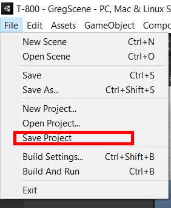

Une fois ceci fait, retournez dans **Fork**, et vous pourrez voir à coté de votre onglet **Changes** le nombre de changements effectués. 

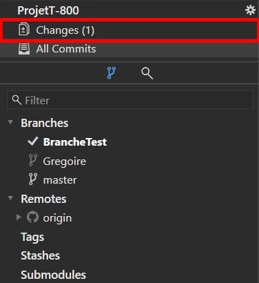

Cliquez dessus et vous verrez tout les **changements** que vous avez effectué, pour pouvoir mettre vos changement **en ligne**, Sélectionnez tout vos changements situés dans **Unstaged** en faisant un **CTRL + A**, et appuyez sur **Stage**.

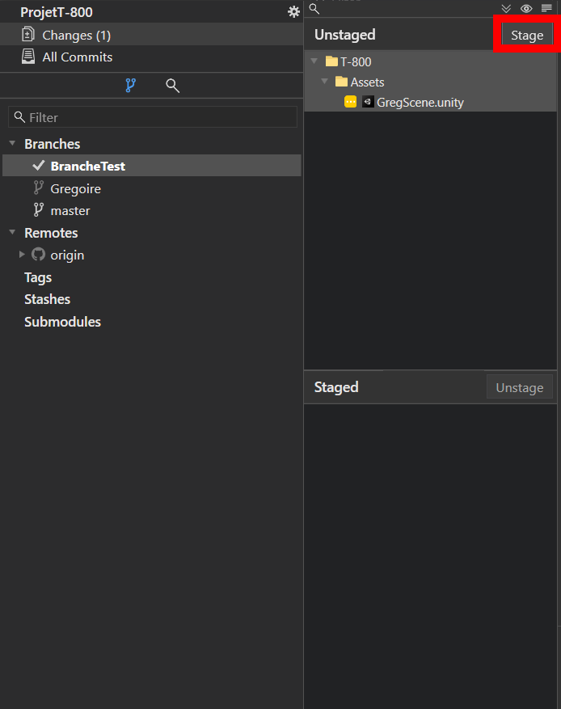

Tout vos changements seront mis dans la case **Stage**, situé juste en dessous de **Unstaged**.

Il faudra mettre un **Titre** à votre commit, et donner les **descriptions de votre commit**.
Tout ceci se fait dans les **blocs de texte** situés **en bas de la fenêtre**. 

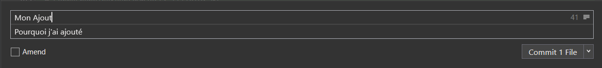

Ensuite il faut **Commit vos changement**. Pour cela, appuyez sur **l'onglet Commit**.

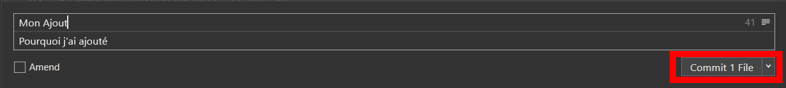

A côté de **votre branche** un **1** est apparut, cela signifie que vous avez **une modification** a envoyer sur **le serveur**. 

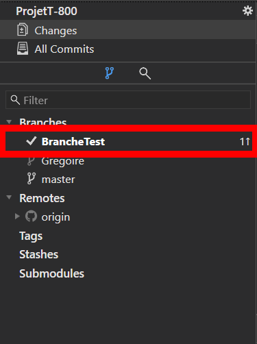

Il vous suffira juste de **Push** vos modification.

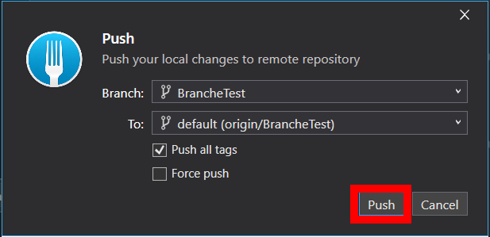

### Récupération de la branche commune

Lorsque votre **Chef Fork** aura créé le **fork**, il devra aussi créer une branche commune de travail afin de **regrouper** toutes **vos modifications**.
Pour récupérer cette branche et y avoir accès, il faudra aller la chercher dans **Les Remotes**, situées en dessous de vos **branches de travail**
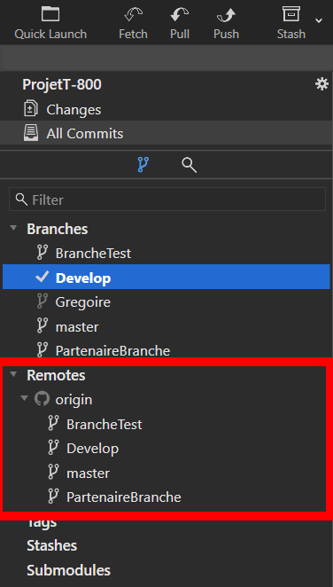

**Double cliquez** sur la **branche commune**, ici c'est **Develop**, une fenêtre va apparaître, il vous suffira de cliquer sur **Track**.

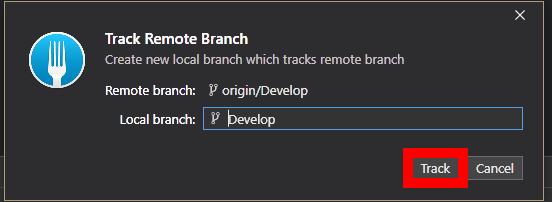

La branche **Develop** apparaît alors dans vos **Branches.**

### Récupération du travail

Avant d'envoyer **vos modifications**, il faut vérifier si vos collègues n'ont pas aussi envoyé quelque chose sur **la branche commune**, pour cela appuyez sur **Fetch**. Une fenêtre s'ouvre, avant de **Fetch** cochez bien la case **Fetch all remote.**

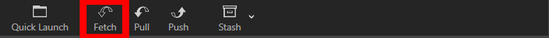

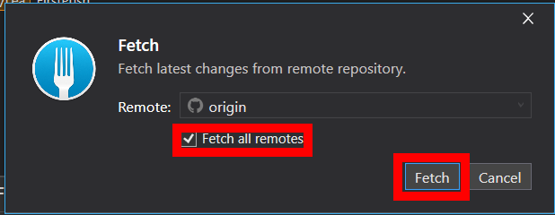

Si il y à eu des modifications sur la **Branche commune**, un numéro avec **une flèche vers le bas** vous l'indiquera.

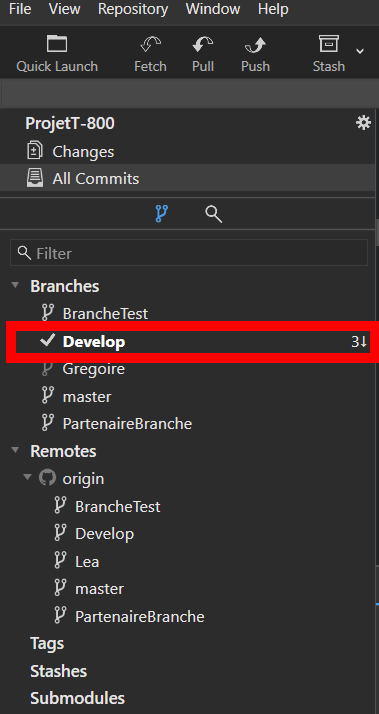

Alors il faudra **Pull** le travail, pour cela, il faudra vous mettre sur **la branche** ou les modifiactions on eu lieu et cliquez sur **Pull**, situé en haut de **Fork** et à **côté de Push.**

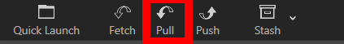

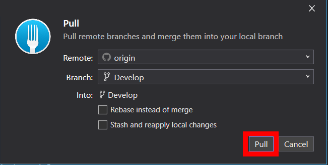

Et voilà **La branche commune** est à jour, vous pouvez maintenant **Merge vos modification.**

### Merge mes modifications sur la branche de travail commune

Il faudra vous mettre sur **la branche commune**, puis faire **clic droit** sur **votre branche de travail**, et cliquer sur **Merge Into "Nom de la branche commune".**

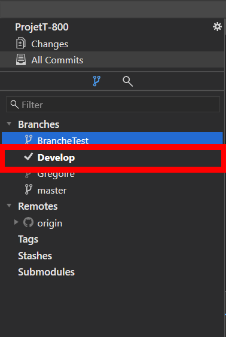

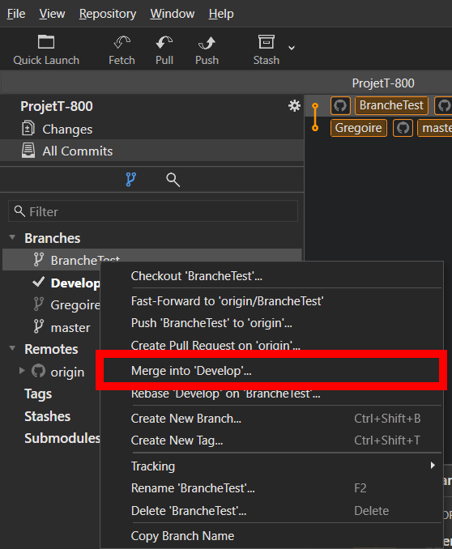

À ce moment une fenêtre s'ouvrira, dans laquelle vous seront demandées vos **Options de merge**, indiquez toujours l'option **NO-Fast Forward**.
Cette fenêtre vous indiquera aussi si il y aura des conflits à résoudre, si jamais cela arrive, demandez à votre "Chef de fork" pour **les résoudres.**
Ensuite, cliquez sur **Merge** pour regrouper vos modifications dans la branche de travail.
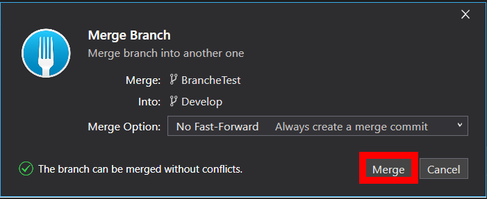

Votre branche de travail aura alors à son tour des **modifications** à envoyer sur **le serveur**, reproduisez l'action de **Push** sur cette branche pour envoyer vos modifications sur le serveur.

Si vous travaillez a plusieurs sur le même projet, vous serez donc plusieurs à envoyer **des modifications** sur votre branche commune, et du coup **votre branche de tavail** ne sera plus à jour, il faudra alors la mettre a jour.

### Remise à niveau de ma branche de travail

Pour mettre votre branche de travail à jour, il vous suffit juste de bien vous mettre sur **votre branche de travail**, et de **Merge la branche commune** dans **votre branche de travail.**

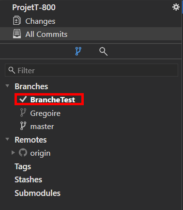
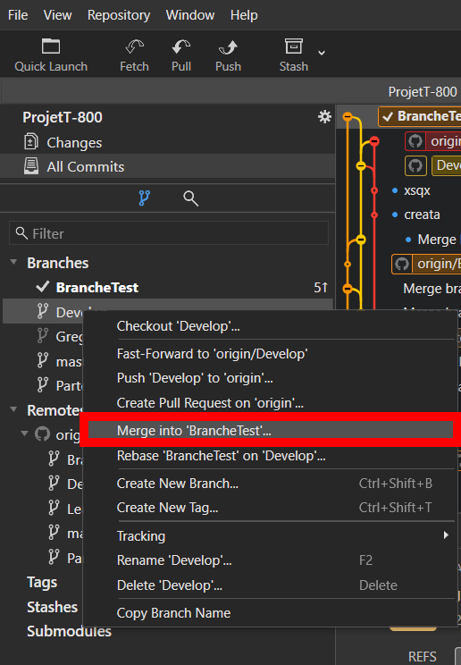
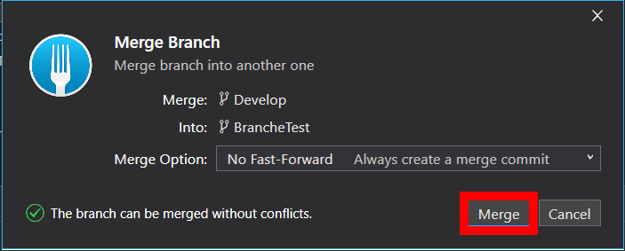

Et il vous suffira alors de push les modifications.
